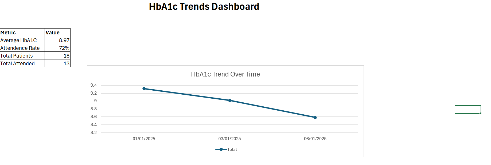

# HbA1c Trends Dashboard (Excel Project)

## Overview
This project is an interactive Excel dashboard analysing HbA1c trends across patient groups. It explores the relationship between appointment attendance, intervention types, and glycaemic control.

## Tools Used
- Microsoft Excel
- Pivot Tables
- Data Visualisation
- KPI Metrics

## Key Features
- HbA1c trend analysis over time
- Comparison by age group
- Attendance vs HbA1c outcomes
- Intervention effectiveness analysis
- KPI summary (Average HbA1c, Attendance Rate)

## Key Insights
- HbA1c levels decreased over time, indicating improved outcomes
- Patients attending appointments showed better glycaemic control
- Engagement and intervention type influenced outcomes

## Files Included
- HbA1c Trends Dashboard.xlsx
- Dashboard screenshots

## Dashboard Preview

